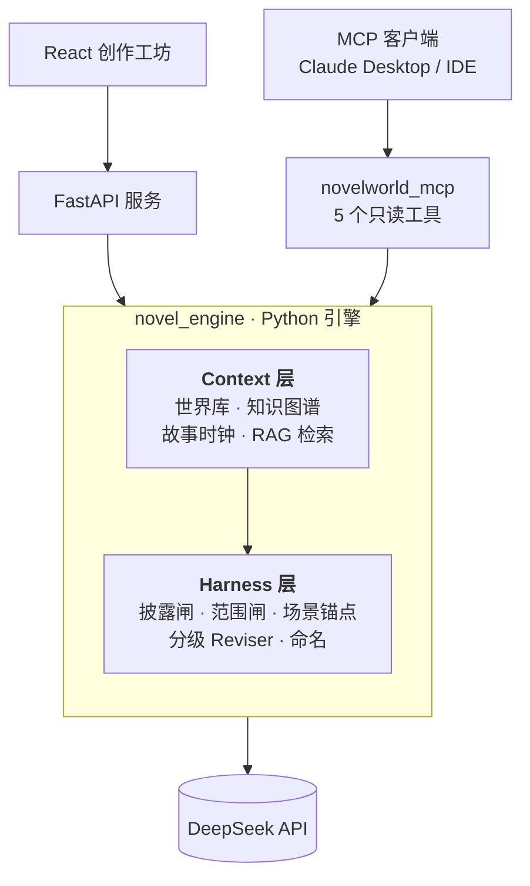
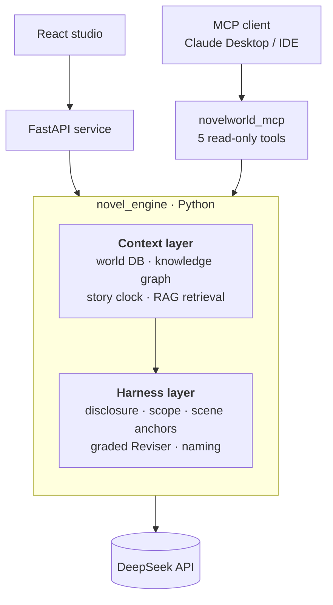

# Novel World
### 一套能从一句话设定写出**整本长篇小说**的 AI 创作系统
**靠一层连续性 Harness,让模型写到几十万字仍不崩。**
*An AI writing system that turns a one-line premise into a **complete novel** — kept coherent across hundreds of thousands of words by a continuity Harness.*

Python 引擎 · FastAPI 服务 · React 创作工坊 · MCP 工具层 · 后端 DeepSeek
*Python engine · FastAPI service · React studio · MCP tool layer · DeepSeek backend*

---

## 中文

> **你给一个世界的种子,它还你一整本书。**
> 从一句话设定出发,自动生成世界观、人物、势力、关系图谱与分卷分章纲,再一章章写下去——人物不跑偏、伏笔有回收、时间线不倒流、销毁的道具不复活。这是大多数"贴 prompt 续写"做不到的:**它真的能把一本书写完,而且前后一致。**

### 能做什么

- **端到端产出**:一句话世界设定 → 世界观/人物/势力/知识图谱 → 分卷分章纲 → 整本正文,全自动闭环,人不必盯着每一步。
- **两种创作模式**
  - **原创**:从零生长一个新世界,锁定设定后一直写到完本。
  - **续写工坊**:导入原作(txt / epub / 多文件)→ 自动切章 → 蒸馏世界观、人物、关系、**文风** → 选择"接着原书写"或"同宇宙开新书"→ 锁定上下文后继续生成。
- **几十万字不崩**:全程连续性护栏兜底——这是本项目的核心竞争力,也是长文本生成最难的部分。
- **文风继承**:从原作蒸馏 author sheet / 文风技能,让续写读起来像作品本身,而不是像设定摘要的口吻。
- **可视化创作工坊**:React 前端,世界配置 / 大纲 / 阅读 / 推演一站式;世界观、人物卡、知识图谱都能在界面里看与改。
- **Agent 可调**:MCP 工具层把引擎暴露成只读工具,任意 MCP 客户端(Claude Desktop / IDE Agent)可直接调用。

### 为什么它能写完一本书(实现核心)

长篇崩盘从来不是单段文笔差,而是**结构性连续性**:人物前后不一、已结束的线索复活、世界规则被后文改写、新旧书之间没有边界。本项目把这些从"人工盯 prompt"变成**系统约束**——即 Context Engineering / Harness Engineering。分三层:

- **Context 层(喂什么)**:把世界观、人物、势力、时间线落成结构化状态(SQLite + 知识图谱),写每一章时按需做 RAG 子图检索 + token 预算注入,只把"这一章该看的"喂给模型,而不是把全书塞进 prompt。
- **Harness 层(怎么管)**:一条"生成 → 审计(P0/P1)→ 修订 → 复审"的护栏流水线,把硬伤挡在出库前:
  - **披露闸门**:控制每条设定/身份"何时能被读者或角色知道",杜绝提前泄底。
  - **范围白名单**:每章只允许授权的角色/地点/道具登场。
  - **故事时钟**:归一化时间线,时间只能向前,不得倒流。
  - **场景锚点**:关键场景(犯罪现场/据点等)跨章一致,地点物证不漂移。
  - **分级 Reviser**:按问题严重度做局部修订,而不是整章重写。
  - **命名子系统**:同职能同名、跨章不撞名、风格统一。
- **接口层(给谁用)**:FastAPI 后端 + React 创作工坊,外加 MCP 工具层。

### 工程亮点(每条都可复现)

1. **离线护栏评测** —— `scripts/eval_harness.py`
   确定性检测器对违规的召回:教科书形态(easy)**100%**,对抗规避(hard:同义改写 / 别名简称 / 隐式时间词)**0%**。我把检测器的能力边界**量化出来而不是藏起来**——它证明字符串/正则层精准但对语义规避全盲,因此必须由 LLM 审计层兜底。
2. **KV-cache 工程** —— `docs/kv-cache-measurement.md`
   定位到 system prompt 里夹了每次都变的 RAG 检索,破坏了 DeepSeek 的自动前缀缓存。重构为 stable-prefix / variable-suffix 后,单次重复调用的 system 命中从 **0 → ~2688 token(≈半个 prompt)**,连续生成累计命中率 **0% → 72%**,直接降低推理成本与首字延迟。每处都有"前缀逐字节一致"的防回归测试。
3. **MCP 工具层** —— `mcp_server/`
   5 个只读、零 LLM 的工具(列项目 / 查世界观 / 查知识图谱 / 列章节 / 跑护栏审计),引擎即 Agent 工具,Claude Desktop 一键接入。
4. **工程素质**:~420 单元测试全过;提交按子系统拆分;对检测器的诚实边界有明确标注。

### 架构


### 快速开始
```bash
pip install -r requirements.txt

python scripts/eval_harness.py          # 跑离线护栏评测,看 easy/hard 召回曲线
python mcp_server/novelworld_mcp.py     # 启动 MCP server(stdio)

cd server && uvicorn app:app --reload   # 后端 API
cd frontend && npm install && npm run dev   # React 创作工坊
```
LLM 配置放在 `server/.data/config.json`(DeepSeek key / 模型 / base_url),不入库。

### 目录
| 路径 | 说明 |
|---|---|
| `src/novel_engine/` | 引擎核心:世界生成、Harness、叙事流水线 |
| `server/` | FastAPI 服务与项目管理 |
| `frontend/` | React 创作工坊 |
| `mcp_server/` | MCP 工具层 |
| `scripts/` | 评测、度量与运维脚本 |
| `docs/` | 设计文档与度量结果 |

详细续写工坊文档见 [`docs/overview-zh.md`](docs/overview-zh.md)。

---

## English

> **Give it the seed of a world, and it returns a whole book.**
> From a one-line premise it auto-generates the world, characters, factions, a relationship graph and a volume/chapter outline, then writes chapter by chapter — characters stay in character, foreshadowing pays off, timelines never run backward, destroyed items never come back. Unlike most "paste-the-prompt-and-continue" setups, **it actually finishes a book, and keeps it consistent.**

### What it does

- **End-to-end generation**: one-line premise → world / characters / factions / knowledge graph → volume & chapter outlines → full prose, a fully automated loop you don't have to babysit step by step.
- **Two modes**
  - **Original**: grow a new world from scratch and write it to completion.
  - **Continuation Workshop**: import a source work (txt / epub / multi-file) → auto-split chapters → distill world, characters, relationships and **writing style** → choose "continue this book" or "new book in the same universe" → lock context and keep generating.
- **Coherent across 100k+ words**: an always-on continuity guard-rail layer — the project's core strength and the hardest part of long-form generation.
- **Style inheritance**: distill an author sheet / style skill from the source so continuations read like the work itself, not like a paraphrase of a setting summary.
- **Visual writing studio**: a React frontend for world config / outline / reading / simulation; world bible, character cards and the knowledge graph are all viewable and editable in the UI.
- **Agent-callable**: an MCP tool layer exposes the engine as read-only tools any MCP client (Claude Desktop / IDE agents) can call directly.

### Why it can finish a book (how it works)

Long-form generation breaks not on prose quality but on **structural continuity**: characters drifting, closed threads reviving, world rules being rewritten downstream, no boundary between old and new books. This project turns those from "babysitting the prompt" into **system constraints** — Context Engineering / Harness Engineering — in three layers:

- **Context layer (what to feed)**: world, characters, factions and timeline live as structured state (SQLite + knowledge graph). For each chapter it runs RAG subgraph retrieval under a token budget, feeding only what *this* chapter needs instead of stuffing the whole book into the prompt.
- **Harness layer (how to govern)**: a *generate → audit (P0/P1) → revise → re-audit* pipeline that stops hard errors before they ship:
  - **Disclosure gate**: controls *when* each fact/identity may become known to the reader or a character — no early leaks.
  - **Scope whitelist**: each chapter may only feature its authorized characters / locations / items.
  - **Story clock**: a normalized timeline; time may only move forward.
  - **Scene anchors**: key scenes (a crime site, a hideout) stay consistent across chapters.
  - **Graded Reviser**: targeted fixes by severity, not whole-chapter rewrites.
  - **Naming subsystem**: same role → same name, no cross-chapter collisions, consistent style.
- **Interface layer (who uses it)**: a FastAPI backend + React studio, plus the MCP tool layer.

### Engineering highlights (all reproducible)

1. **Offline guard-rail eval** — `scripts/eval_harness.py`
   Deterministic detectors recall **100%** on textbook violations but **0%** on hard adversarial ones (paraphrase / alias / implicit time words). The detector's limits are **quantified, not hidden**: string/regex matching is precise yet blind to semantic evasion, so an LLM audit layer is required as backstop.
2. **KV-cache engineering** — `docs/kv-cache-measurement.md`
   The system prompt embedded a per-call RAG block, defeating DeepSeek's automatic prefix cache. After refactoring to a stable-prefix / variable-suffix structure, per-repeat-call system tokens served from cache went from **0 → ~2688 (≈half the prompt)**, cumulative hit rate **0% → 72%**, cutting inference cost and time-to-first-token. Each fix is locked by a "byte-identical prefix" regression test.
3. **MCP tool layer** — `mcp_server/`
   Five read-only, LLM-free tools (list projects / get world bible / query knowledge graph / list chapters / audit chapter) turn the engine into agent-callable tools, one-click into Claude Desktop.
4. **Engineering quality**: ~420 unit tests passing; commits split by subsystem; detector limits documented honestly.

### Architecture


### Quick start
```bash
pip install -r requirements.txt

python scripts/eval_harness.py          # run the offline guard-rail eval
python mcp_server/novelworld_mcp.py     # start the MCP server (stdio)

cd server && uvicorn app:app --reload       # backend API
cd frontend && npm install && npm run dev   # React studio
```
LLM config lives in `server/.data/config.json` (DeepSeek key / model / base_url), never committed.

### Layout
| Path | What |
|---|---|
| `src/novel_engine/` | Engine core: world generation, Harness, narration pipeline |
| `server/` | FastAPI service & project management |
| `frontend/` | React writing studio |
| `mcp_server/` | MCP tool layer |
| `scripts/` | Eval, measurement & ops scripts |
| `docs/` | Design docs & measurement results |

Detailed continuation-workshop docs (Chinese): [`docs/overview-zh.md`](docs/overview-zh.md).
